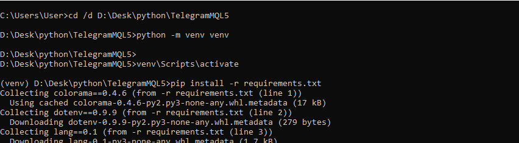
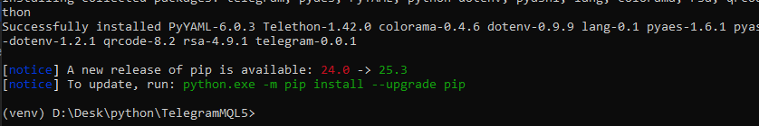
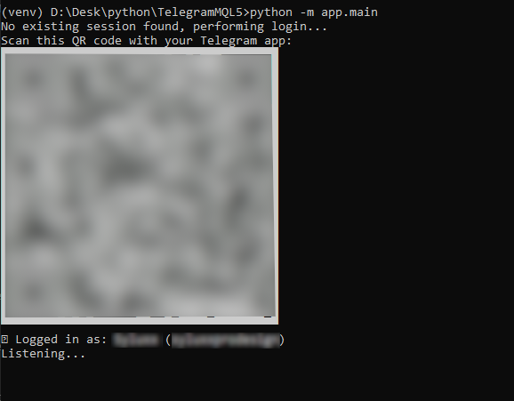
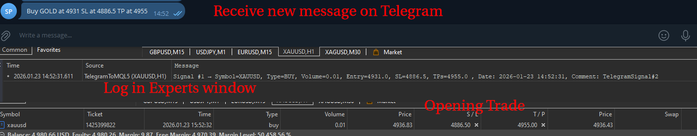

# TelegramMQL5

TelegramMQL5 is a Python project that listens to a Telegram group, parses trading signals, and saves them in JSON format for integration with MQL5 trading platforms.

It supports **MessageFilter parsing**, **signal mapping**, and **secure login** via Telegram API with QR code or 2FA.

---

## Table of Contents

* [Features](#features)
* [Requirements](#requirements)
* [Installation](#installation)
* [Configuration](#configuration)
* [Usage](#usage)

  * [Running the main bot](#running-the-main-bot)
  * [Testing MessageFilter](#testing-messagefilter)
* [Session Management](#session-management)
* [Project Structure](#project-structure)
* [License](#license)

---

## Features

* Listen to a Telegram group for trading signals.
* Parse messages using `MessageFilter` and handle errors gracefully.
* Supports multi-line signals with emojis and multiple TP/SL values.
* Map user-friendly names (`GOLD`, `SILVER`) to actual trading symbols (`XAUUSD`, `XAGUSD`).
* Save signals in `signals.json` with timestamps and metadata.
* Easy manual testing via `test.py`.

---

## Requirements

* Python 3.11+

Install python from this [**python official page**](https://www.python.org/ftp/python/3.11.0/python-3.11.0-amd64.exe)

---

## Installation

1. Download .rar given.
2. UnZip it
3. Open `cmd` window : Alt + Window => cmd
4. Go to folder TelegramMQL5
```bash
cd /d C:\path\to\unziped\TelegramMQL5
```
5. Create a virtual environment (optional but recommended):
```bash
python -m venv venv
venv\Scripts\activate
```
6. Install requirements:
```bash
pip install -r requirements.txt
```




Now you have all environnement set.

---

## Configuration

Go to the provided config template `TelegramMQL5/app/config/config.ini` and fill in your credentials:

```ini
[telegram]
api_id = 123456
api_hash = abcdef1234567890
phone = +33123456789
session_name = telegram_session
group_name = MyTradingGroup

[paths]
mql_file_dir = C:\Users\User\AppData\Roaming\MetaQuotes\Terminal\<YourTerminalID>\MQL5\Files

[trading]
pairs = XAUUSD, EURUSD, SILVER, BTCUSD, GOLD

[pair_mapping]
GOLD = XAUUSD
SILVER = XAGUSD
ETH = ETHUSD

[mql]
default_lot = 0.01
comment = TelegramSignal
```

> ⚠️ Important – Required Configuration Variables
> 
> Before running the bot, you must carefully fill in the following variables in config.ini. Incorrect values will prevent TelegramMQL5 from connecting to Telegram or saving signals correctly.

* **`api_id` / `api_hash`**: obtained from [my.telegram.org](https://my.telegram.org).
  - Tutorial [here](https://www.youtube.com/watch?v=kCDUbJU99F8) at 2m35
* **`session_name`**: the filename used to store your session (`telegram_session.session`).
* **`group_name`**: name of the Telegram group you want to get messages from.
  - **Required**: If this is incorrect, the bot won’t receive messages.
* **`mql_file_dir`**: Replace <YourUser> and <YourTerminalID> with your Windows username and your MT5 terminal ID..
  - **Required**: This ensures that the bot writes the signals JSON (signals.json) into the correct folder that your EA will read.
* **`pairs`**: list of trading symbols the parser will accept.
* **`pair_mapping`**: maps user-friendly names used in Telegram messages to the actual trading symbols on MQL5.  
  - For example, if the Telegram message contains `GOLD`, `pair_mapping` allows the parser to automatically convert it to `XAUUSD`, which is the symbol used in your MQL5 platform.  
  - This ensures that messages like `Buy: GOLD` or `Sell: SILVER` can be correctly interpreted and saved with the proper symbol for trading.
* **`default_lot`**: the lot you want to open in your trade.

---

## Usage

### Running the main bot

```bash
python -m app.main
```

**How it works:**

* The bot will automatically check if a Telegram session file (`session_name.session`) exists.

* **If the session does not exist** (first run):

    1. A **QR code** will appear in the terminal.
    2. Scan the QR code with your Telegram app (Desktop or Mobile).
    3. The login is authorized and a new session file is created automatically.

* **If your account has 2FA enabled**, the bot will prompt you to enter your password after scanning the QR code.

* On subsequent runs, the bot will **reuse the existing session file** automatically, so you won’t need to scan the QR code again.

* Once connected, the bot will start listening to the configured Telegram group and log all messages in `logs/telegram_log.txt`.

**Example workflow for the first connection:**

1. Run the bot:

```bash
python -m app.main
```

2. Terminal displays a QR code:

```
████████████████████████
█ ▄▄▄▄▄ █ ▄▀▀ █ ▄▄▄▄▄ █
█ █   █ █▀▀▀▀▀█ █   █ █
█ █▄▄▄█ █ ▀▄▀ █ █▄▄▄█ █
█▄▄▄▄▄▄▄█▄▄█▄▄█▄▄▄▄▄▄▄█
```

3. Open your Telegram app → Settings → Devices → Scan QR code
4. Telegram authorizes the session and creates `telegram_session.session`
5. Bot prints:

```
✅ Logged in as: (username)
Listening...
```



From now on, you can just run the bot without scanning the QR code again.

6. To stop the bot: press **`CTRL + C`**. Terminal will show:

```
KeyboardInterrupt
Disconnected from Telegram.
```

---

### Testing MessageFilter

```bash
python -m app.test
```

* Allows you to paste **any Telegram message** manually.
* Multi-line messages with emojis are supported.
* Finish by entering an **empty line** to start parsing.

**Example message to test:**

```
Buy : XAUUSD
🎯 Entry : 4822
⛔️ Stop : 4812,62
🚀 TP 1 : 4842,6
🚀 TP 2 : 4962,62
🚀 TP 3 : 4852,62
```

* Paste this message in the terminal.
* The parser will detect **direction**, **entry price**, **stop loss**, and all **TP values**.
* Any parsing errors are logged using `FailedParseMessage`.

---

## Session Management

* Session files are saved as `session_name.session`.
* Telethon will automatically reuse existing sessions.
* To force a new login, delete the session file:

```bash
del telegram_session.session # Windows
```

* If no session exists, a **QR code** will appear in the terminal for login.
* If your account has 2FA enabled, the script will prompt for the password.

---

## MQL5 Integration

To use the signals parsed by **TelegramMQL5** in MetaTrader 5, follow these steps:

### 1. Copy EA files

* Copy the EA file from the repository:

```
TelegramMQL5/TelegramToMQL5.ex5
```

* Paste it into your MetaTrader 5 Experts folder:

```
C:\Users\<YourUser>\AppData\Roaming\MetaQuotes\Terminal\<YourTerminalID>\MQL5\Experts
```

> Replace `<YourUser>` and `<YourTerminalID>` with your Windows username and your MT5 terminal ID.

### 2. Launch MetaTrader 5

* Open MT5 and load the Expert Advisor (EA) on **any chart**.
* In the **Experts** window, verify that there are **no errors**.
* The EA will automatically read the signals from `signals.json` and execute trades according to your settings.

### 4. Run TelegramMQL5

* Start the Python bot as usual:

```bash
python -m app.main
```

* Wait for messages in your configured Telegram group.
* Each parsed signal is saved in `signals.json` inside the MT5 `Files` folder.
* The EA will pick up these signals and execute trades accordingly.

> ⚠️ Make sure your **`pair_mapping`** in `config.ini` correctly maps the names in Telegram messages (e.g., `GOLD`) to the MQL5 symbols (e.g., `XAUUSD`). This ensures that the EA executes trades on the correct instrument.



## License

© 2026 Trolard Vincent – All rights reserved.
