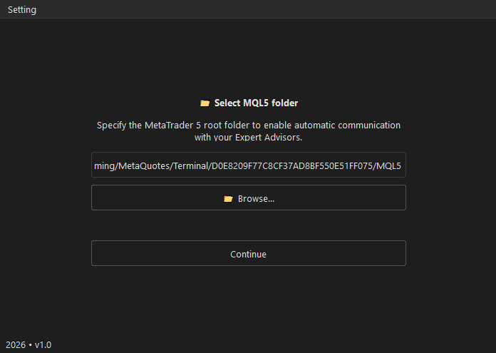
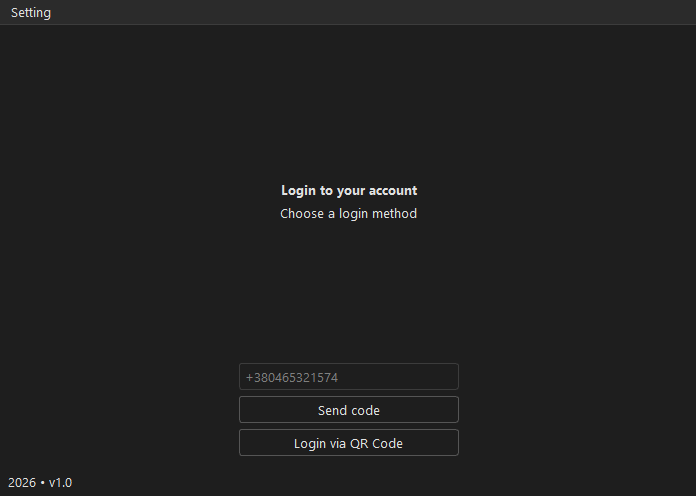
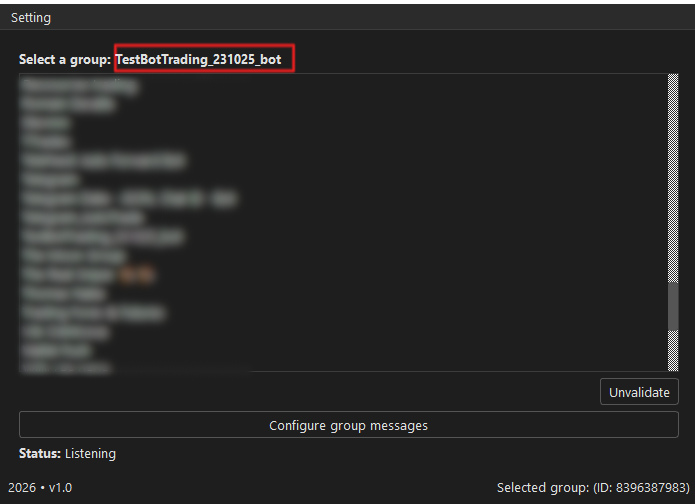
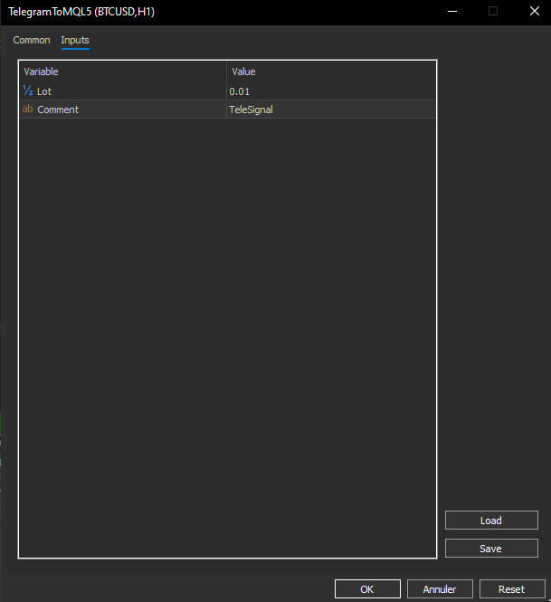

# Telegram to MQL5

**Version: 1.0 (2026)**
**Author: Vincent TROLARD**

**Description:**
Telegram to MQL5 is an application that connects your Telegram account to MetaTrader 5 to automatically send commands to your Expert Advisors (EAs) and manage Telegram groups and messages directly from MetaTrader.

---

## Installation

1. **Download**

   * Download the executable `TelegramToMQL.exe` from the official site or project repository.

2. **Run**

   * Double-click `TelegramToMQL.exe` to start the application.

3. **First Launch**

   * On first launch, select your **MetaTrader 5 root folder** to allow communication with your Expert Advisors (EAs).
   * Connect your Telegram account and configure your groups.

---

## Usage

1. **Launch the application:** TelegramToMQL.exe

2. **Loading page:**

   * Wait while the application starts.

3. **Select MQL5 folder:**

   * Click **📂 Browse...** to select the root folder of MetaTrader 5. Default path:

   > C:\Users<YourUser>\AppData\Roaming\MetaQuotes\Terminal<YourTerminalID>\MQL5\Experts

   * Click **Continue** to proceed to the next page.
   * **Menu:** You can change the folder anytime via **Menu → Change MQL Folder**.

   
   *Caption: Select the MetaTrader 5 folder where Expert Advisors are installed.*

4. **Telegram login:**

   * Enter your phone number and click **Send code**, or use **Login via QR Code**.
   * If you use the code, enter it in the field and click **Login**.

   
   *Caption: Login with phone number or QR code.*

5. **Select Telegram groups:**

   * Choose the group(s) you want to use.
   * Click **Validate** to confirm.
   * You can configure automated messages with **Configure group messages**.
   * Once the group is selected and **Validate** is clicked, the group name will be displayed at the top.
   * ***Status Listening***: The program is now listening to the group. Incoming messages will be parsed.

   
   *Caption: Select the Telegram group(s) to parse messages from.*

6. **Track actions:**

   * Status information appears at the bottom of the interface (footer).

---

## Message Customization

The application allows you to **configure your own keyword expressions** to automatically detect orders in Telegram messages.

Each type of information has its corresponding **key field**:

| Key Field              | Description                                 | Default Example Values                                      |
| ---------------------- | ------------------------------------------- | ----------------------------------------------------------- |
| `Order Type Keyword`   | Words indicating order type (buy/sell)      | `buy, sell, achat, vente, long, short`                      |
| `Entry Price Keyword`  | Words indicating entry price                | `Entry zone, at, now, prix d entree, sell, buy, entry`      |
| `Stop Loss Keyword`    | Words indicating stop loss                  | `stop loss, stop-loss, sl, sl @, STOPLOSS, Stop`            |
| `Take Profit Keyword`  | Words indicating take profits               | `take profit, TProfit, take-profit, tp, TakeProfit, TARGET` |
| `Symbol Keyword`       | Standard trading symbols                    | `GOLD, BTC, EURUSD, USDJPY, XAUUSD, EURJPY, ETH`            |
| `Custom Symbol Matchs` | Custom symbol mapping (e.g., GOLD → XAUUSD) | `GOLD=XAUUSD, BTC=BTCUSD`                                   |

### Example of a valid message

```
XAUUSD BUY NOW 4409
❌‼️ STOP LOSS 4394
✔️ 1/ Take Profit 4415
✔️ 2/ Take Profit 4425
✔️ 3/ Take Profit 4460
```

**Automatic interpretation:**

* Symbol: `XAUUSD`
* Order Type: `BUY`
* Entry: `4409`
* Stop Loss: `4394`
* Take Profits: `4415, 4425, 4460`

> ✅ All information is found because keywords match the defaults.

---

### Example of an invalid message

```
XAUUSD BU NOW 4409 
❌‼️ STOP LOSS 4394
✔️ 1/ Take Profit 4415
✔️ 2/ Take Profit 4425
✔️ 3/ Take Profit 4460
```

**Problem:**

* `BU` does not match a valid order type keyword (`BUY, SELL, ...`).
* The application returns an error: `Order type cannot found in message`.

**Solution:**

* Add `BU` as a keyword in the **Order Type Keyword** field via **Configure group messages**:

```
Order Type Keyword: buy, BU, sell, achat, vente, long, short
```

* After this change, the message will be parsed correctly.

### Customization Tips

1. **Add multiple synonyms**: separate with commas.
2. **Case sensitivity?** No, parsing is case-insensitive.
3. **Use custom symbols**: add them in `Custom Symbol Matchs` using the format `NAME=MT5_SYMBOL`.
4. **Test messages**: send them in Telegram to verify parsing works.

---

## MetaTrader

To communicate with MetaTrader and execute orders automatically, install the **Expert Advisor (EA)** `TelegramToMQL5.ex5` in the **Experts** folder of MetaTrader 5.

### Steps

1. **Open the MQL5 folder**

   * You selected the **MetaTrader 5 root folder** in the app (`Select MQL5 Folder`).
   * Example: `C:\Users\<YourUser>\AppData\Roaming\MetaQuotes\Terminal\<YourTerminalID>\MQL5`

2. **Place the EA in the `Experts` subfolder**

   * Inside the MQL5 folder: `Indicators`, `Scripts`, `Experts`, etc.
   * Copy **TelegramToMQL5.ex5** into **`Experts`**.
   * Final path:

     ```
     <MQL5_Folder>\Experts\TelegramToMQL5.ex5
     ```

3. **Configure the EA in MetaTrader 5**

   * Open MetaTrader 5.

   * In the **Navigator (Ctrl+N)**, go to **Expert Advisors → TelegramToMQL5**.

   * Drag and drop the EA onto a chart.

   * In **EA Properties**, configure the two main inputs:

     * **lot** – lot size for trades
     * **comment** – optional comment to identify orders in history

   * Ensure **Allow automated trading** is enabled.

   
   *Caption: Configure EA inputs for lot size and comment.*

4. **Test communication**

   * Once the EA is active, all orders detected by Telegram in the app will execute automatically.
   * Messages are interpreted based on keywords configured in **Configure group messages**.

---

### Important Notes

* **MQL5 folder must be correct**, otherwise the EA cannot receive instructions.
* Place the EA on a chart (any symbol and timeframe works).
* Adjust **lot** according to your risk management and capital.
* **Comment** is optional but helps track orders in history.

---

## Usage Tips

* Make sure MetaTrader 5 is closed or files are unlocked when selecting the folder.
* Ensure your Telegram phone number is correct to receive the code.
* Always select the **root folder** containing `MQL5` to avoid EA communication issues.

---

## FAQ

**Q: Telegram code does not arrive?**
A: Check logs at **AppData/Roaming/TelegramMQL/logs/telegram_log.log**

**Q: Can I change the MQL5 folder after first launch?**
A: Yes, use **Menu → Change MQL Folder**.

**Q: Works on Mac or Linux?**
A: Mainly tested on Windows; some features may need adjustments.

